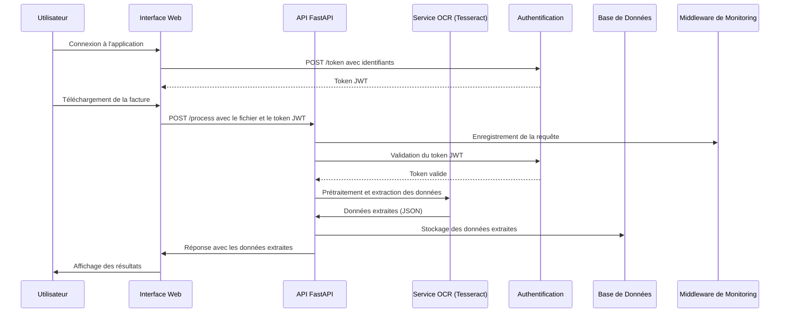

# Application OCR - Gestion et Analyse des Factures

## Description

Cette application a pour objectif d'automatiser la gestion et l'analyse des factures en utilisant l'OCR pour extraire des données, les stocker dans une base de données, les analyser, et les présenter dans une interface web. Elle inclut :
- Une démonstration d'extraction OCR sur un fichier.
- Un dashboard d'analyse des données de facturation avec un système de clustering des clients.
- Un dashboard de monitoring des performances de l'application.

## Fonctionnalités

- Extraction des données des factures via OCR (Tesseract).
- Stockage des données extraites dans une base de données PostgreSQL.
- Analyse des données avec clustering (RFM et KMeans).
- Visualisation des données via une interface web (Flask).
- Monitoring des performances OCR et API.

## Technologies utilisées

- **Backend** : FastAPI
- **OCR** : Tesseract avec OpenCV pour le prétraitement des images.
- **Base de données** : PostgreSQL (hébergée sur Azure).
- **Frontend** : Flask avec Bootstrap.
- **Clustering** : RFM et KMeans (Scikit-learn).
- **Monitoring** : Middleware de monitoring en mémoire.
- **CI/CD** : GitHub Actions (partiellement implémenté).

## Installation

Préparation de l'environnement :

```bash
python -m venv venv
venv\Scripts\activate  # Sur Linux : source venv/bin/activate
pip install -r requirements.txt
```

## Utilisation

1. Lancer le backend FastAPI :
   ```bash
   python app/app/main.py
   ```
2. Lancer le frontend Flask :
   ```bash
   python frontend/app.py
   ```
3. Accéder à l'application via le navigateur à l'adresse : `http://localhost:5000`.

## Fonctionnement de l'application

### Architecture
L'application est divisée en deux services principaux :
- **Backend** : Gère l'OCR, le clustering, et les interactions avec la base de données.
- **Frontend** : Fournit une interface utilisateur pour interagir avec les factures, les clusters, et les dashboards de monitoring.

### Flux de fonctionnement
1. **Téléchargement et traitement OCR** :
   - L'utilisateur télécharge une facture via l'interface web.
   - Le backend utilise Tesseract pour extraire les données après un prétraitement avec OpenCV.
   - Les données extraites sont nettoyées, validées, et stockées en base de données.

2. **Analyse des données** :
   - Les données des factures sont analysées pour générer des clusters de clients via RFM et KMeans.
   - Les résultats sont visualisés sous forme de graphiques et tableaux.

3. **Monitoring** :
   - Les performances de l'OCR (taux d'erreur, temps de traitement) et de l'API (temps de réponse, erreurs) sont suivies via un middleware de monitoring.

### Diagramme de séquence
Voici un exemple de flux pour le traitement OCR d'une facture :



## Améliorations possibles

- Résolution des problèmes de compatibilité pour le pipeline CI/CD.
- Gestion des seuils de qualité OCR et intégration d'une boucle de retour utilisateur (Human Feedback Loop).
- Optimisation des performances pour réduire les temps de traitement.
- Ajout de filtres et graphiques supplémentaires pour les visualisations.